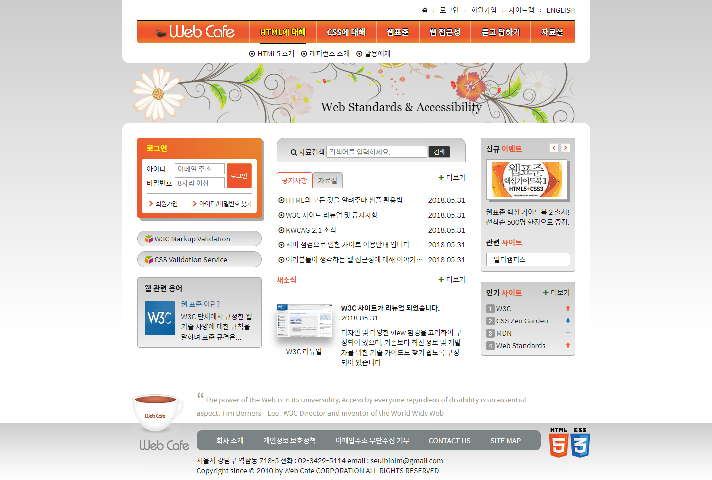
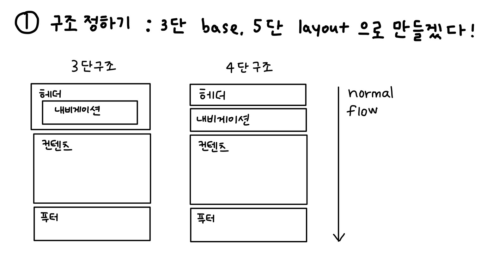
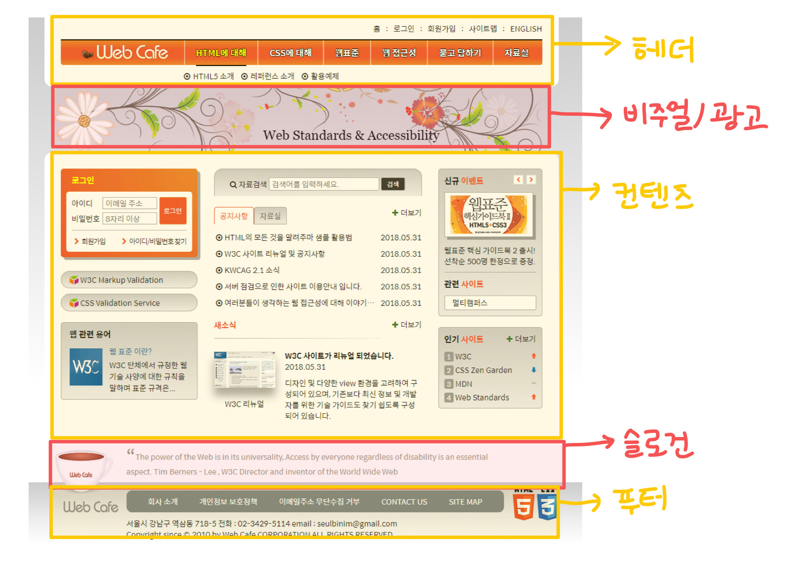
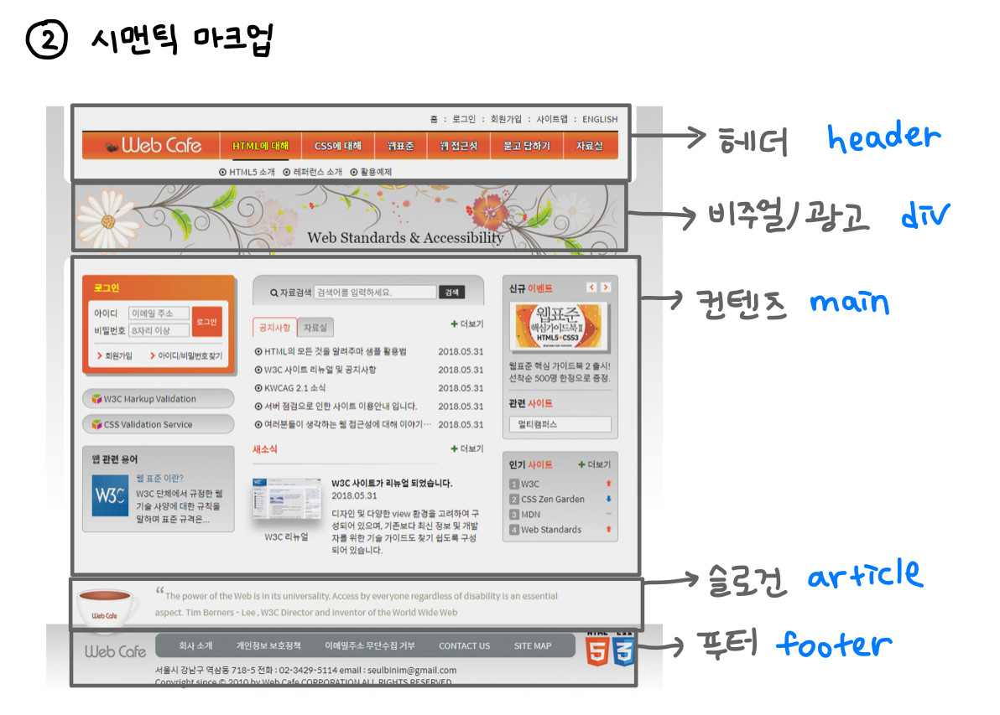
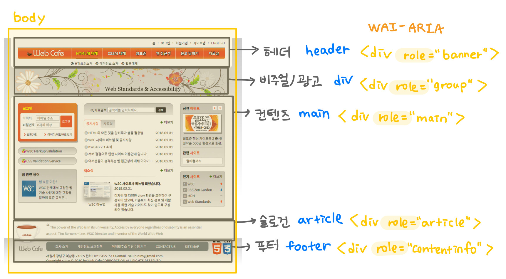
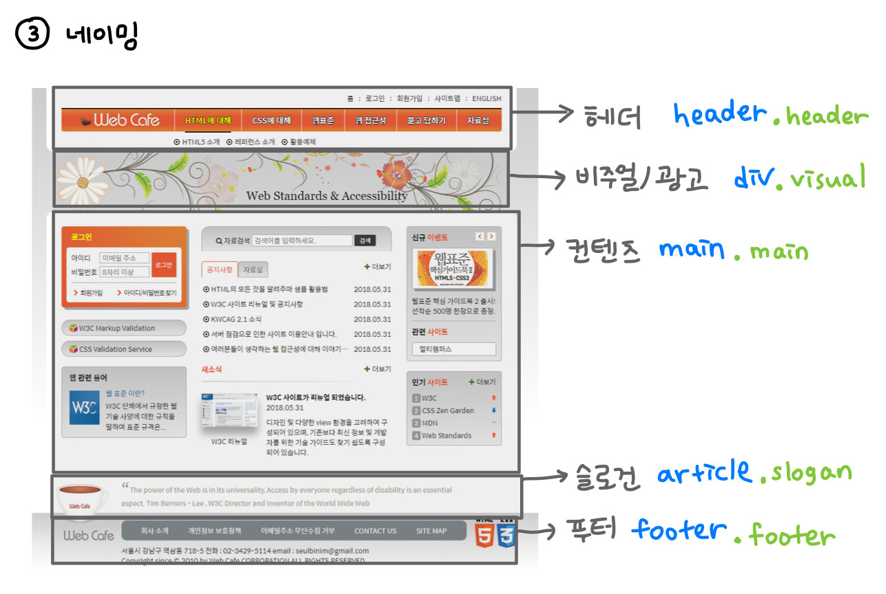
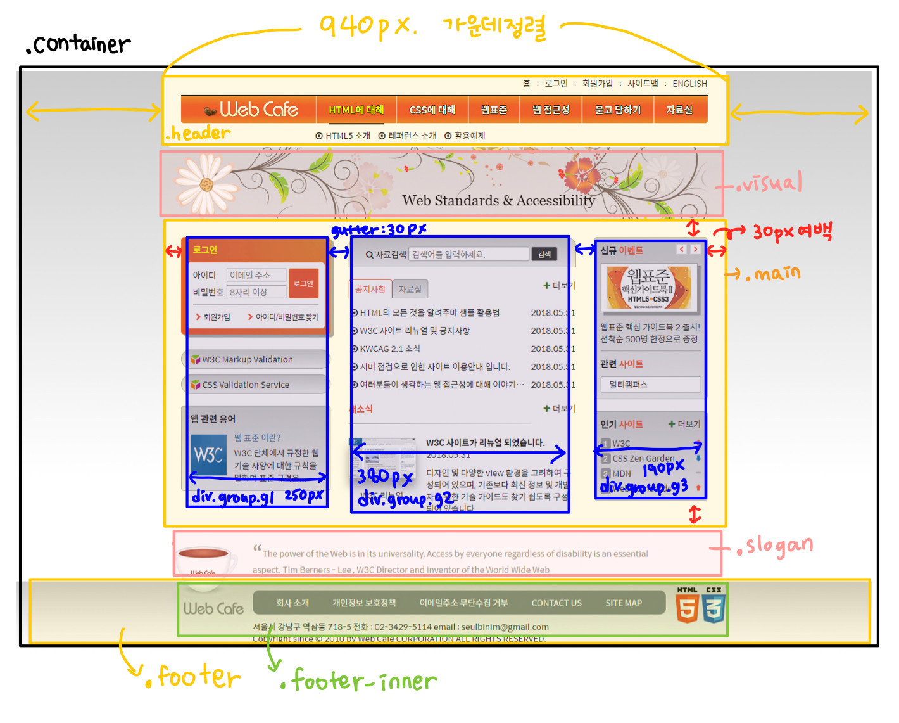

# 📝 Daily Learning Log - 01

📌 웹카페 기본 구조 설계  
📌 기본 CSS 설정  
📌 메인 콘텐츠 flex 레이아웃  

### HTML

🔍 [DOCTYPE](#html_1)
🔍 [lang](#html_2)
🔍 [charset](#html_3)
🔍 [http-equiv](#html_4)
🔍 [viewport](#html_5)
🔍 [title](#html_6)
🔍 [emmet](#html_7)

### CSS

🔍 [web font](#css_1)
🔍 [normalize.css](#css_2)
🔍 [font-size(rem)](#css_3)
🔍 [auto margin trick](#css_4)
🔍 [flex](#css_5)
🔍 [box-sizing](#css_6)

## 📐 웹카페 기본 구조 설계 

  

### 1. 구조 정하기  

구조는 크게 3단 구조, 4단 구조로 나누어 볼 수 있다. 웹페이지 시안을 보고 구조를 어떻게 나눌 지 결정한다. 우선, 헤더 안에 내비게이션이 포함된 3단 구조를 base로 선택했다. 헤더 아래의 비주얼/광고 영역은 콘텐츠 영역과 분리하고, 푸터 위의 글귀 또한 웹사이트 정보와는 다른 성격을 가지므로 슬로건 영역으로 분리했다. 
    > 3단 구조 base에 비주얼 영역, 슬로건 영역을 추가하여 5단 레이아웃으로 결정

    ~~normal flow 내용 추가~~  




### 2. semantic markup

컴퓨터가 이해 가능한, 컴퓨터 처리가 가능한 적절한 태그를 선택하는 단계이다. 시맨틱 태그란 내용이 화면에 표현되는 방식을 결정하는 것이 아니라, 해당 내용에 **어떤 의미(역할 또는 목적)** 를 부여하기 위해 사용하는 태그이다. 예를 들어 `<h1>제목</h1>`에서 h1 태그를 사용함으로써 태그 안 내용이 웹페이지의 **최상위 제목** 이라는 의미를 갖게 된다. 이렇게 각 구조에 어떤 태그를 사용하면 좋을지 결정한다.  



#### 💡 시맨틱 태그를 사용했을 때의 장점  

1. 검색 엔진 최적화(SEO)
    검색엔진이 웹사이트를 크롤링할 때는 웹페이지가 담고 있는 데이터에 초점을 둔다. 따라서 웹페이지가 전체적으로 어떤 구조를 가지고, 콘텐츠가 어떻게 구성되어 있는지가 중요하다. 만약 모든 콘텐츠가 `<div>` 태그로만 마크업되어 있다면 검색엔진이 효과적으로 웹사이트를 분석하기 어려울 것이다.  

2. 웹 접근성
    스크린리더가 웹페이지의 내용을 음성으로 안내하는 경우 또한 시맨틱 마크업이 적용되지 않은 웹페이지의 경우 내용이나 구조를 파악하기 어려울 것이다.  

3. 코드의 가독성
    '의미'에 따라 시맨틱 마크업을 잘 작성할 경우 코드만으로도 웹페이지 구성을 쉽게 파악할 수 있다.  

> 시맨틱 태그는 **브라우저, 검색엔진, 개발자**  모두에게 콘텐츠의 의미를 명확히 설명하는 역할을 하게 됩니다. 또한 HTML 요소의 의미를 보다 명확히 해석하고 그 데이터를 활용할 수 있는 시맨틱 웹이 실현됩니다.  
> 시멘틱 웹이란 웹에 존재하는 수많은 웹페이지들에 메타데이터를 부여해서, 기존의 잡다한 데이터 집합이었던 웹페이지를 의미와 관련성을 가지는 **거대한 데이터베이스** 로 구축하고자 하는 발상입니다.

🔍 참고 사이트
[html 시맨틱 마크업](https://www.daleseo.com/html-semantic-markup/)
[시맨틱 마크업 발표자료](https://www.slideshare.net/headvoy/best-practice-of-html5-semantic-markup)
[시맨틱 웹 낱낱이 파헤치기](https://ideveloper2.tistory.com/164)
[시맨틱 웹](https://velog.io/@kimu2370/%EC%8B%9C%EB%A7%A8%ED%8B%B1-%EB%A7%88%ED%81%AC%EC%97%85)
[MDN- HTML 태그](https://developer.mozilla.org/en-US/docs/Web/HTML/Element)
[구글 검색엔진 최적화(SEO) 기본 가이드](https://developers.google.com/search/docs/beginner/seo-starter-guide?hl=ko#who-is-this-guide-for)

#### 💡 `<div>` 태그만 사용했다면?  WAI-ARIA




### 3. 네이밍

클래스 네임을 결정한다.



### 4. 코드 작성

```html 

<!DOCTYPE html>  <!-- 01 -->
<html lang="ko">  <!-- 02 -->  
  <head>
    <meta charset="UTF-8" />  <!-- 03 -->
    <meta http-equiv="X-UA-Compatible" content="IE=edge" />  <!-- 04 -->
    <meta name="viewport" content="width=device-width, initial-scale=1.0" />  <!-- 05 -->
    <title>웹카페 - HTML5,CSS3</title>  <!-- 06 -->
    <link rel="stylesheet" href="../css/stylesheet.css" />
  </head>
  <body>
    <div class="container">
      <header class="header">header</header>  <!-- 07 -->
      <div class="visual">visual</div>
      <main class="main">
        <div class="group group1">group1</div>  <!-- 08 -->
        <div class="group group2">group2</div>
        <div class="group group3">group3</div>
      </main>
      <article class="slogan">slogan</article>
      <footer class="footer">
        <div class="footer-inner">footer</div>
      </footer>
    </div>
  </body>
</html>

```


<h5 id="html_1">✅ 01 DOCTYPE</h5>

`<!DOCTYPE html>`  
doctype 을 html5 으로 지정

<h5 id="html_2">✅ 02 lang</h5>

`<html lang="ko-KR">`  

<h5 id="html_3">✅ 03 charset</h5>

`<meta charset="UTF-8" />`  
`meta:utf` emmet을 이용했을 때 작성되는 `<meta http-equiv="Content-Type" content="text/html;charset=UTF-8">` 와 같다.  
둘 다 표준인데 간소화된 문법을 선호한다.  
인코딩 선언은 항상 문서의 최상단에, title보다 먼저해야 글자 깨짐을 방지할 수 있다.  

<h5 id="html_4">✅ 04 http-equiv</h5>

`<meta http-equiv="X-UA-Compatible" content="IE=edge" />`  
`X-` 이 붙어있으면 비표준, `UA`는 user agent를 의미, 문서의 렌더링엔진을 변경하는 옵션 지정  
`IE=8` 이라면 8 버전의 렌더링을 하는 것, `IE=edge`는 최신 버전으로 렌더링하라는 것  

<h5 id="html_5">✅ 05 viewport</h5>

`<meta name="viewport" content="width=device-width, initial-scale=1.0" />`  
스마트폰은 가상 해상도를 쓰기 때문에, 모바일 뷰가 아니라 큰 화면을 작게 축소해서 렌더링할 수도 있다.  
반응형 웹을 만들 경우에는 viewport 를 꼭 선언하기  

<h5 id="html_6">✅ 06 title</h5>

`<title>웹카페 - HTML5,CSS3</title>`  
모든 페이지의 제목은 달라야한다. SEO 네이버에 돈내면 되니까 ㅎㅎ 순수 검색엔진. 구글 seo를 높일 수 있다. 매출이 저조하고, seo 개선 의뢰
키워드는 `,`로 구분하고 공백없이 단어만 쓰는 걸 추천한다.  
불필요한 장식문자는 자제한다. 스크린리더가 불필요한 문자를 다 읽어주고, 검색봇이 반복문자가 여러개면 스팸으로 여길 수도 있다.  

<h5 id="html_7">✅ 07 & 08 emmet </h5>

emmet | code 
:---: | :---:
`header.header{header}`|`<header class="header">header</header>`
`div.group.group$*3{group$}`|`<div class="group group1">group1</div>`<br>`<div class="group group2">group2</div>`<br>`<div class="group group3">group3</div>`



```css

@import url(https://spoqa.github.io/spoqa-han-sans/css/SpoqaHanSansNeo.css);   /* -- 01 -- */
@import url(./normalize.css);   /* -- 02 -- */

html {
  font-size: 10px;  /* -- 03 -- */
}

body {
  background-color: #fff;
  font-family: "Spoqa Han Sans", "sans-serif";   /* -- 01 -- */
  font-weight: 400;   /* -- 01 -- */
  color: #181818;
  font-size: 1.4rem;  /* -- 03 -- */
}

body *,
body *::before,
body *::after {
  box-sizing: border-box;  /* -- 04 -- */
}   

.header,
.visual,
.main,
.slogan,
.footer-inner {
  margin: 0 auto;  /* -- 05 -- */
  width: 940px;
}

.main {
  display: flex;
  justify-content: space-between;  /* -- 06 -- */
  padding: 30px;
  height: 60vh;
}

```

<h5 id="css_1">✅ 01 font</h5>
<h5 id="css_2">✅ 02 normalize.css vs reset.css</h5>
<h5 id="css_3">✅ 03 font-size (rem)</h5>
<h5 id="css_4">✅ 04 auto margin trick</h5>
<h5 id="css_5">✅ 05 flex</h5>


div 는 block 요소이기 때문에 수직 정렬되어 있다. 수평정렬하기 위해서는 여러가지 방법을 적용할 수 있다.  
1. display: flex 
2. float: left
3. display: inline-block
4. display: grid (주로 큰 영역의 레이아웃 잡을 때 사용한다)

1, 2 번의 방법이 많이 사용되는데 우선 flex를 이용해본다.  
.main 에 display: flex 를 적용했을 때 item의 기본값은 width: auto, height: stretch 이기 때문에 아래와 같이 나타난다.  
item(.group) 각각의 계산했던 width를 지정하고 간격을 주는 방법을 고민해본다. 

item 에 `justify-content: space-evenly` 를 적용하면 아주 간단하게 만들 수 있지만 IE 에서 지원하지 않는다.  

다른 방법은 무엇이 있을까? 여러가지 방법이 있겠지만 main에 padding:30px;을 주고 item 에 `justify-content: space-between`을 줄 수 있다.

<h5 id="css_6">✅ 06 box-sizing</h5>

위에서 padding을 지정했을 때, 화면이 생각했던 대로 나오지 않는다. div 의 box-sizing 기본값은 content-box이기 때문에 너비 = 콘텐츠 너비 + 패딩 + 보더 + 마진 을 갖기 때문이다. 
